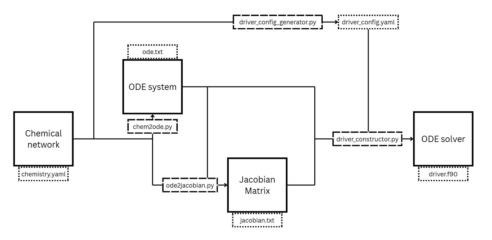

# Project description

The main purpose of chem2odePy is to streamline and optimize preprocessing steps for ISM chemistry simulation. This package aims to encapsulate all preparation steps and integrate with ODE solvers specific for the task. 

# Package architecture/structure

Currently, the package includes 3 main modules for simulation preparation:
1. Chemical network YAML standard
2. Chemical network to ODE system translator
3. ODE system to Jacobian Matrix translator
4. Solver Fortran code generator

## YAML standard

*chemistry_yaml_template.yaml* describes a standardized way of writing down chemical networks using YAML. This standard is infinitely scalable and allows for flexible further integrations. It is intuitive enough for manual construction and can be easily parsed programmatically. *chemistry.yaml* file presents an example of an abstract chemistry network with 3 species and 2 reversible reactions.

## Network to ODE translator

*chem2ode.py* file contains Python code of the first translator, which uses the chemistry, described in *chemistry.yaml*, to produce *ode.txt*. *ode.txt* contains the ODE system, written as required by the Livermore ODE solver, which is currently used. The *ode.txt* provided shows the ODE system derived from the example chemical network.

## ODE to Jacobian translator

*ode2jacobian.py* file contains Python code of the second translator, which uses both the chemical network (*chemistry.yaml*) and ODE system (*ode.txt*) to produce *jacobian.txt*. *jacobian.txt* contains the Jacobian Matrix written as required by the Livermore ODE solver, which is currently used. The *jacobian.txt* provided shows the Jacobian Matrix derived from the example network and ODE. 

## Solver Fortran code generator

*driver_config_generator.py* file contains Python code that generates a config file with soma variables needed for the simulations. The resulting file (*driver_config.yaml*) includes some default values that can be corrected.
*driver_constructor.py* file contains Python code that generates Fortran code for the Livermore Solver. Takes *ode.txt*, *jacobian.txt* and *driver_config.yaml* as input. The result is a *driver.f90* file (based on *driver_template.f90*) which is to be compiled and ran with the Livermore Solver (see next paragraph).

**Note:** This module is not yet included into the Linux build (see next paragraph).

# Build and user manual

## Preprocessing

For easy use, the package has been compiled for Windows as a one-file build, Linux coming soon (see *Build* folder). Running *program_win.exe* ~~or *program_linux.exe*~~ will launch a command-line wizard for calling necessary functions in the correct order. 

**Note:** First, you need to generate the ODE, Jacobian and config files, then generate the Livermore driver file. Otherwise, an error will occur.

## Livermore solver integration

The final result is a *driver.f90* Fortran file that can be compiled (alongside *dlsode.f*) using the *compile* bash file into an executable *program* file using ifort compiler (see *Livermore Solver* folder).

# Future development

Below is the list of future features that are to be considered and developed:
- [x] Scalability and performance testing
- [x] Solver variables configurator
- [x] Automatic Livermore Solver integration
  - [ ] Include in the build
- [ ] Unified ODE and Jacobian standard (not solver-specific)
- [ ] ODE and Jacobian standard to solver-specific syntax translators
  - [ ] Livermore Solver
  - [ ] Radau5 Solver
- [ ] Hydrodynamics integration
